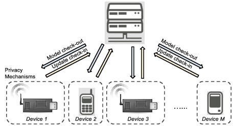

### Crowd-ML (Machine Learning)
#### is a framework for a crowd of devices to perform machine learning with privacy.

Smart and connected devices are becoming increasingly pervasive in daily life,
including smartphones, wearables, smart home appliance, smart meters, connected cars, surveillance cameras, 
enviromental sensors, etc. 
Can we benefit from the analysis of massive data generated from such devices, without central collection of all data nor the breach of users' privacy?
More specifically, can we outsource the machine learning to crowd of connected devices with a guarantee of differential privacy? 
(The idea has been featured in [Gigaom] (https://gigaom.com/2015/01/22/researchers-show-a-machine-learning-network-for-connected-devices/).) 

### What it does
The library allows devices (Android, iOS, and python clients) to learn a common classifier/regression model with differential privacy, by solving the ERM problem: min_w f(w) = 1/M sum_{i=1}^M f_i(w), where f_i(w) = 1/n sum_j l(h_w(x_{ij}), y_{ij}).
The library implements private distributed synchronous risk minimization based on [Hamm'15][Hamm'15], using [Google Firebase](https://firebase.google.com/) as a simple and robust syncrhonization method.  
A user can decide the type and amount of noise to guarantee differential privacy under different assumptions, 
such as in [Rajkumar'12][Rajkumar'12],[Song'13][Song'13],[Bassily'14][Bassily'14]. 
By selecting no noise, a user can use the libary as a crowd-based parallel or distributed optimization of general functions [Tsitsiklis'84][Tsitsiklis'84],[Agarwal'11][Agarwal'11],[Dekel'11][Dekel'11]. 

### Features
#### Implemented client types
Android (JAVA), iOS (Objective C), linux (python)

#### Implemented server types
Node.js

#### Available options

* Loss function / classifiers: binary logistic regression, softmax, binary SVM with hindge loss 
* Noise:  type {Laplace, Gaussian}, scale s
* Learning rate: constant, 1/t, 1/sqrt{t}, AdaGrad, RMSprop
* Client- and server-side minibatch

#### Examples
* MNIST-binary
* MNIST-10

### How to use the Crowd-ML library
#### 1. Set up firebase account.
See [firebase/readme.md](firebase/readme.md) for more instructions.
#### 2. Download and build client apps
Currently, the client uses pre-stored local data such as MNIST.
The users of this library should replace it with custom data sensing or collecting routines.
For iOS devices, see [client/iOS/readme.md](client/iOS/readme.md).
For Android devices, see [client/android/readme.md](client/android/readme.md).
For python clients, see [client/python/readme.md](client/python/readme.md).
#### 3. Download and change server-side app.
See [server/readme.md](server/readme.md) for more instructions.
#### 4. Distribute client apps to users and start the server-side app.

### Acknowledgements

* Jihun Hamm (PI, OSU [homepage](https://web.cse.ohio-state.edu/~hammj/))
* Jackson Luken (Undergraduate, OSU)
* Yani Xie (Undergraduate, OSU)
  
This research was supported in part by Google Faculty Research Award 2015 and Google Internet of Things Technology Research Award 2016. 

### License
Released under the Apache License 2.0.  See the [LICENSE.txt](LICENSE.txt) file for further details.

### References
*[Hamm'15]: J. Hamm, A. Champion, G. Chen, M. Belkin, and D.Xuan, 
"Crowd-ML: A privacy-preserving learning framework for a crowd of smart devices." In Proceedings of the 35th IEEE
International Conference on Distributed Computing Systems (ICDCS). IEEE, 2015. (docs/icdcs15_jh_final.pdf)
*[Rajkumar'12]: A. Rajkumar, and S. Agarwal. "A differentially private stochastic
gradient descent algorithm for multiparty classification." In AISTATS, 2012, pp. 933–941
*[Song'13]: S. Song, K. Chaudhuri, and A. D. Sarwate, "Stochastic gradient descent with differentially private updates," in Proc. IEEE GlobalSIP, 2013.
*[Bassily'14]: R. Bassily, A. Smith, and A. Thakurta, A. "Private empirical risk minimization: Efficient algorithms and tight error bounds." In Foundations of Computer Science (FOCS), 2014, pp. 464-473
*[Tsitsiklis'84]: J.N. Tsitsiklis, D.P. Bertsekas, and M. Athans, "Distributed asynchronous deterministic and stochastic gradient optimization algorithms." in American Control Conference, 1984, pp. 484-489 
*[Agarwal'11]: A. Agarwal and J. C. Duchi, "Distributed delayed stochastic optimiza-
tion." in Proc. NIPS, 2011, pp. 873–881.
*[Dekel'11]: O. Dekel, R. Gilad-Bachrach, O. Shamir, and L. Xiao, "Optimal distributed online prediction," in Proc. ICML, 2011.

